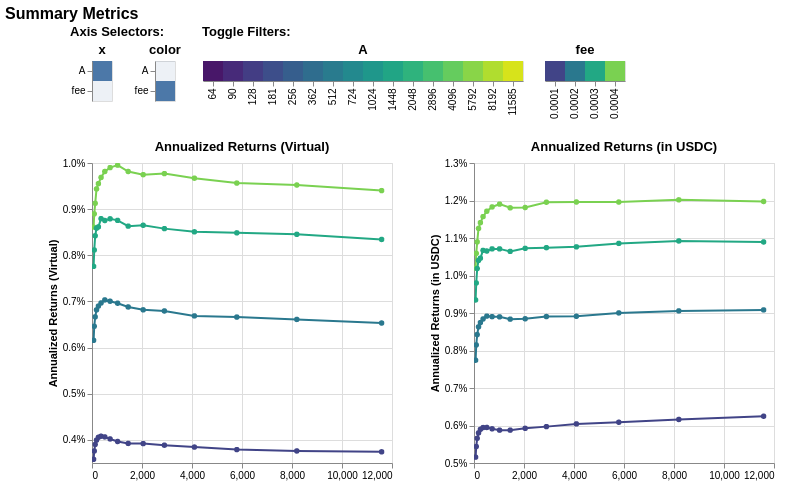
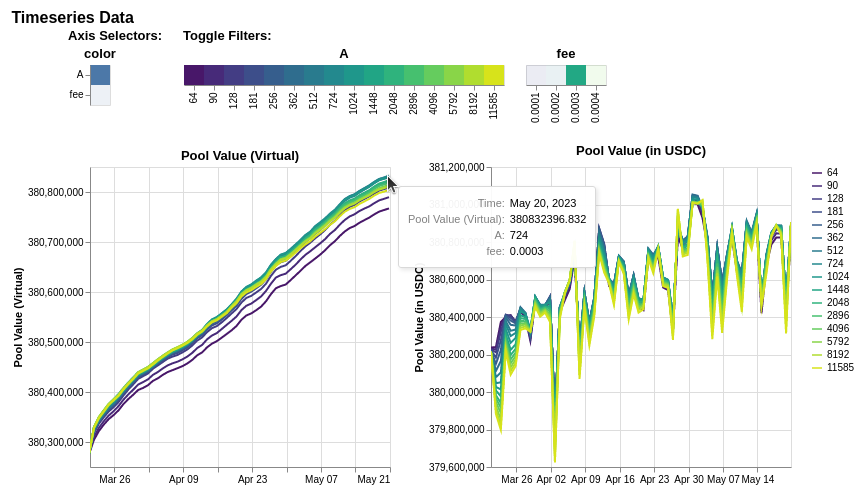

.. role:: python(code)
   :language: python

:tocdepth: 2

.. _quickstart:

Quickstart
==========

This guide will help you get up-and-running with Curvesim.

First, make sure that:

* Curvesim is :ref:`installed <install>`
* Curvesim is :ref:`up-to-date <updates>`

Hello world
------------

Before digging into more interesting examples, let's check the installed package can
run without issues.  In the console, run::

    $ python3 -m curvesim
    [INFO][13:58:06][curvesim.price_data.sources]-27988: Fetching CoinGecko price data...
    [INFO][13:58:07][curvesim.pool_data.cache]-27988: Fetching historical volume...
    [INFO][13:58:07][curvesim.network.subgraph]-27988: Volume end date: 2023-05-18 00:00:00+00:00
    [INFO][13:58:33][curvesim.pipelines.utils]-27988: Volume Multipliers: 3.18995731844421e-05
    [INFO][13:58:33][curvesim.pipelines.arbitrage]-27988: [3Crv] Simulating with {'A': 100, 'fee': 3000000}
    [INFO][13:58:43][curvesim.pipelines.arbitrage]-27988: [3Crv] Simulating with {'A': 100, 'fee': 4000000}
    [INFO][13:58:52][curvesim.pipelines.arbitrage]-27988: [3Crv] Simulating with {'A': 1000, 'fee': 3000000}
    [INFO][13:59:00][curvesim.pipelines.arbitrage]-27988: [3Crv] Simulating with {'A': 1000, 'fee': 4000000}
    Elapsed time: 62.90428018569946

Fetch a pool from a chain
-------------------------

If you know the address of the pool for the chain you want, you can easily start
interacting with it. Curvesim allows you to introspect on the pool's state and use its
functions without submitting actual transactions on chain.

Begin by importing the Curvesim module::

    >>> import curvesim

Let's retrieve the famous 3Pool from Ethereum Mainnet::

    >>> pool = curvesim.pool.get("0xbEbc44782C7dB0a1A60Cb6fe97d0b483032FF1C7", "mainnet")

Now, we have a :class:`Pool <curvesim.pool.Pool>` object called ``pool``. Its state is
pulled from daily snapshots of the `Curve volume subgraph <https://github.com/curvefi/volume-subgraphs>`_.
From this object we can retrieve state information and see the result of pool 
operations such as swaps or adding liquidity.

The pool interface adheres closely to the live smart contract's, so if you are familiar
with the vyper contract, you should feel at home.

For example, to check various data about the pool::

    >>> pool.A
    2000

    >>> pool.D()
    792229855185904089753030799

    >>> pool.balances
    [221310603060971366741693471,
     209546983349734000000000000,
     361385319858769000000000000]

Notice this is already more convenient than how you would need to query the state on
the actual smart contract.

You can also easily check the impact of trades or how many LP tokens you receive from
depositing::

    # check out-token amount and fees paid
    >>> dx = 12345 * 10**6
    >>> pool.exchange(2, 1, dx)
    (12340177006, 1234141)

    # check amount of LP tokens received
    >>> amounts = [100 * 10**18, 50 * 10**6, 25 * 10**6]
    >>> pool.add_liquidity(amounts)
    97835056610971313989

You can change pool parameters and see the impact of trades::

    >>> pool.A = 3000
    >>> pool.exchange(2, 1, dx)
    (12341372567, 1234260)

Let's try doing something a little more interesting... pull a metapool::

    # fetch metapool, MIM-3CRV, off Mainnet
    >>> pool = curvesim.pool.get("0x5a6A4D54456819380173272A5E8E9B9904BdF41B", chain="mainnet")
    >>> pool.basepool
    <CurvePool address=0xbEbc44782C7dB0a1A60Cb6fe97d0b483032FF1C7 chain=mainnet>

    # trade between primary stablecoin of the metapool versus a basepool underlyer
    >>> pool.exchange_underlying(3, 0, dx)
    (12373797212, 4951499)

If you want to dig into the pulled data that was used to construct the pool::

    >>> pool.metadata
    {'name': 'Curve.fi Factory USD Metapool: Magic Internet Money 3Pool',
     'address': '0x5a6A4D54456819380173272A5E8E9B9904BdF41B',
     'chain': 'mainnet',
     'symbol': 'MIM-3LP3CRV-f',
     'version': 1,
     'pool_type': 'METAPOOL_FACTORY',
     'params': {'A': 2000, 'fee': 4000000, 'fee_mul': None},
     'coins': {'names': ['MIM', '3Crv'],
      'addresses': ['0x99D8a9C45b2ecA8864373A26D1459e3Dff1e17F3',
       '0x6c3F90f043a72FA612cbac8115EE7e52BDe6E490']},
     'reserves': {'D': 145335238128075486893034024,
      'by_coin': [124846609724462731254676673, 20488636137518846234875982],
      'virtual_price': 1008020913339661772,
      'tokens': 144178792527792985122545269},
     'basepool': {'name': 'Curve.fi DAI/USDC/USDT',
      'address': '0xbEbc44782C7dB0a1A60Cb6fe97d0b483032FF1C7',
      'chain': 'mainnet',
      'symbol': '3Crv',
      'version': 1,
      'pool_type': 'REGISTRY_V1',
      'params': {'A': 2000, 'fee': 1000000, 'fee_mul': None},
      'coins': {'names': ['DAI', 'USDC', 'USDT'],
       'addresses': ['0x6B175474E89094C44Da98b954EedeAC495271d0F',
        '0xA0b86991c6218b36c1d19D4a2e9Eb0cE3606eB48',
        '0xdAC17F958D2ee523a2206206994597C13D831ec7']},
      'reserves': {'D': 792242906269082651836451728,
       'by_coin': [221310603060971366741693471,
        209546983349734012345000000,
        361385319858768987652644961],
       'virtual_price': 1022181723917474348,
       'tokens': 775050940289599852028917731},
      'basepool': None,
      'timestamp': 1667347200,
      'init_kwargs': {'A': 2000,
       'D': 792242906269082651836451728,
       'reserves': [221310603060971366741693471,
        209546983349734012345000000,
        361385319858768987652644961],
       'n': 3,
       'fee': 1000000,
       'fee_mul': None,
       'tokens': 775050940289599852028917731}},
     'timestamp': 1667347200,
     'init_kwargs': {'A': 2000,
      'D': 145335238128075486893034024,
      'reserves': [124846609724462731254676673, 20488636137518846234875982],
      'n': 2,
      'fee': 4000000,
      'fee_mul': None,
      'tokens': 144178792527792985122545269}}

Run an arbitrage simulation for a proposed A parameter
------------------------------------------------------

Tuning a pool parameter, such as the amplification coefficient ``A``, can greatly affect the
risk-reward profile.  The ``A`` parameter alters the curvature of the bonding curve, directly
impacting the pool's ability to handle large trades while holding imbalanced reserves.::

    >>> import curvesim
    >>> mim = "0x5a6A4D54456819380173272A5E8E9B9904BdF41B"
    >>> res = curvesim.autosim(mim, chain="mainnet", A=875)
    Fetching CoinGecko price data...
    Fetching historical volume...
    Volume Multipliers:
    [9.59195904e-07 9.59195904e-07 9.59195904e-07 2.36911915e-05
     2.36911915e-05 2.36911915e-05]
    [MIM-3LP3CRV-f] Simulating with {'A': 875, 'fee': 1000000}
    [MIM-3LP3CRV-f] Simulating with {'A': 875, 'fee': 2000000}
    [MIM-3LP3CRV-f] Simulating with {'A': 875, 'fee': 3000000}
    [MIM-3LP3CRV-f] Simulating with {'A': 875, 'fee': 4000000}

Likely you will want to see the impact over a range of ``A`` values.  The ``A`` and ``fee`` parameters will accept either a integer or iterables of integers; note ``fee`` values are in units of basis points multiplied by 10**6.::
    
    >>> res = curvesim.autosim(mim, chain="mainnet", A=range(500, 1500, 250), fee=4000000)
    Fetching CoinGecko price data...
    Fetching historical volume...
    Volume Multipliers:
    [9.59195904e-07 9.59195904e-07 9.59195904e-07 2.37521074e-05
     2.37521074e-05 2.37521074e-05]
    [MIM-3LP3CRV-f] Simulating with {'A': 750, 'fee': 4000000}
    [MIM-3LP3CRV-f] Simulating with {'A': 1000, 'fee': 4000000}
    [MIM-3LP3CRV-f] Simulating with {'A': 1250, 'fee': 4000000}
    [MIM-3LP3CRV-f] Simulating with {'A': 500, 'fee': 4000000}

Run an arbitrage simulation varying multiple parameters
--------------------------------------------------------

You may also want to see how different ``A`` and ``fee`` parameters perform in conjuction.
If you input multiple iterables for parameters, each possible combination of parameters is simulated::

    >>> res = curvesim.autosim(mim, chain="mainnet", A=[100, 1000], fee=[3000000, 4000000])
    Fetching CoinGecko price data...
    Fetching historical volume...
    Volume Multipliers:
    [9.59195904e-07 9.59195904e-07 9.59195904e-07 2.37521074e-05
     2.37521074e-05 2.37521074e-05]
    [MIM-3LP3CRV-f] Simulating with {'A': 100, 'fee': 3000000}
    [MIM-3LP3CRV-f] Simulating with {'A': 100, 'fee': 4000000}
    [MIM-3LP3CRV-f] Simulating with {'A': 1000, 'fee': 3000000}
    [MIM-3LP3CRV-f] Simulating with {'A': 1000, 'fee': 4000000}

Results
-------

The simulation returns a SimResults object (here, ``res``) that can plot simulation metrics or return them as DataFrames.

Plotting
^^^^^^^^

The ``plot()`` method is used to generate and/or save plots::

    #Plot results using Altair
    >>> res.plot() 

    #Save plot results as results.html
    >>> res.plot(save_as="results.html")

Screenshots of resulting plots (truncated):
^^^^^^^^^^^^^^^^^^^^^^^^^^^^^^^^^^^^^^^^^^^

Metrics
^^^^^^^

The ``summary`` method returns metrics summarizing each simulation run::

    >>> res.summary()
    metric pool_value_virtual         pool_value  ...   pool_volume price_error
    stat   annualized_returns annualized_returns  ...           sum      median
    0                0.003580           0.005156  ...  2.286297e+09    0.000669
    1                0.006158           0.007741  ...  1.966299e+09    0.000600
    2                0.007760           0.009348  ...  1.652965e+09    0.000775
    3                0.008611           0.010200  ...  1.377299e+09    0.000956
    4                0.003760           0.005439  ...  2.400174e+09    0.000777
    ..                    ...                ...  ...           ...         ...
    59               0.009523           0.012018  ...  1.521524e+09    0.001155
    60               0.003742           0.006247  ...  2.388746e+09    0.001063
    61               0.006533           0.009082  ...  2.084530e+09    0.000915
    62               0.008344           0.010894  ...  1.775963e+09    0.000974
    63               0.009402           0.011974  ...  1.502494e+09    0.001133

To include the parameters used in each run, use the ``full`` argument::

    >>> res.summary(full=True)
            A             D  ...  pool_volume sum  price_error median
    0      64  3.802712e+08  ...     2.286297e+09            0.000669
    1      64  3.802712e+08  ...     1.966299e+09            0.000600
    2      64  3.802712e+08  ...     1.652965e+09            0.000775
    3      64  3.802712e+08  ...     1.377299e+09            0.000956
    4      90  3.802712e+08  ...     2.400174e+09            0.000777
    ..    ...           ...  ...              ...                 ...
    59   8192  3.802712e+08  ...     1.521524e+09            0.001155
    60  11585  3.802712e+08  ...     2.388746e+09            0.001063
    61  11585  3.802712e+08  ...     2.084530e+09            0.000915
    62  11585  3.802712e+08  ...     1.775963e+09            0.000974
    63  11585  3.802712e+08  ...     1.502494e+09            0.001133

The ``data`` method returns metrics recorded at each timestamp of each run::

    >>> res.data()
           run                 timestamp  ...      pool_volume  price_error
    0        0 2023-03-21 23:30:00+00:00  ...  15206414.533633     0.005310
    1        0 2023-03-22 00:30:00+00:00  ...    7278720.40969     0.002029
    2        0 2023-03-22 01:30:00+00:00  ...   6125207.553072     0.000100
    3        0 2023-03-22 02:30:00+00:00  ...    7066251.03295     0.000100
    4        0 2023-03-22 03:30:00+00:00  ...   3512782.000945     0.000299
    ...    ...                       ...  ...              ...          ...
    93755   63 2023-05-21 19:30:00+00:00  ...    879436.331564     0.000893
    93756   63 2023-05-21 20:30:00+00:00  ...              0.0     0.001091
    93757   63 2023-05-21 21:30:00+00:00  ...    720837.826971     0.000800
    93758   63 2023-05-21 22:30:00+00:00  ...    445967.506177     0.001414

The data method also accepts the ``full`` argument. However, the output may be prohibitively large::

    >>> res.data(full=True)
               A             D     fee  ...    pool_fees      pool_volume  price_error
    0         64  3.802712e+08  0.0001  ...  1522.608454  15206414.533633     0.005310
    1         64  3.802712e+08  0.0001  ...   727.480283    7278720.40969     0.002029
    2         64  3.802712e+08  0.0001  ...   614.494463   6125207.553072     0.000100
    3         64  3.802712e+08  0.0001  ...   707.021149    7066251.03295     0.000100
    4         64  3.802712e+08  0.0001  ...   352.544017   3512782.000945     0.000299
    ...      ...           ...     ...  ...          ...              ...          ...
    93755  11585  3.802712e+08  0.0004  ...   351.854745    879436.331564     0.000893
    93756  11585  3.802712e+08  0.0004  ...     0.000000              0.0     0.001091
    93757  11585  3.802712e+08  0.0004  ...   288.500150    720837.826971     0.000800
    93758  11585  3.802712e+08  0.0004  ...   178.639272    445967.506177     0.001414
    93759  11585  3.802712e+08  0.0004  ...   156.525641    391060.986022     0.000906

    [93760 rows x 13 columns]

Fine-tuning the simulator
-------------------------
Other helpful parameters for :func:`.autosim` are:

    - ``src``: data source for prices and volumes.  Allowed values are:

      - **"coingecko"**: CoinGecko API (free); default
      - **"local"**: local data stored in the "data" folder

    - ``ncpu``: Number of cores to use.
    - ``days``: Number of days to fetch data for.
    - ``vol_mode``: Modes for limiting trade volume

      - 1: limits trade volumes proportionally to market volume for each pair
      - 2: limits trade volumes equally across pairs
      - 3: mode 2 for trades with meta-pool asset, mode 1 for basepool-only trades

    - ``test``: Sets ``A`` and ``fee`` params to a small set of values for testing purposes.

Tips
----

Pricing data
^^^^^^^^^^^^^

By default, Curvesim uses Coingecko pricing and volume data.  To replace the no
longer available Nomics service, we expect to onboard another data provider and
also provide an option to load data files.

Note on CoinGecko Data
"""""""""""""""""""""""
Coingecko price/volume data is computed using all trading pairs for each coin, with volume summed across all pairs. Therefore, market volume taken from CoinGecko can be much higher than that of any specific trading pair used in a simulation. This issue is largely ameloriated by our volume limiting approach, with CoinGecko results typically mirroring results from pairwise data, but it should be noted that CoinGecko data may be less reliable than more granular data for certain simulations.

Parallel processing
^^^^^^^^^^^^^^^^^^^
By default, Curvesim will use the maximum number of cores available to run
simulations.  You can specify the exact number through the ``ncpu`` option.

For profiling the code, it is recommended to use ``ncpu=1``, as common
profilers (such as ``cProfile``) will not produce accurate results otherwise.

Errors and Exceptions
---------------------

All exceptions that Curvesim explicitly raises inherit from
:exc:`curvesim.exceptions.CurvesimException`.

-----------------------

Ready for more? Check out the :ref:`advanced <advanced>` section.

